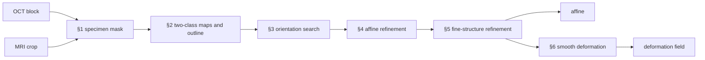
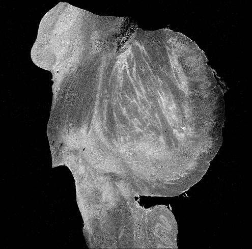
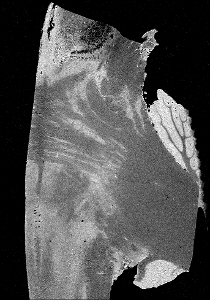
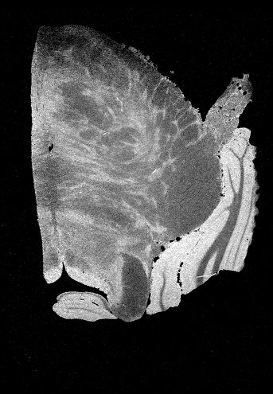
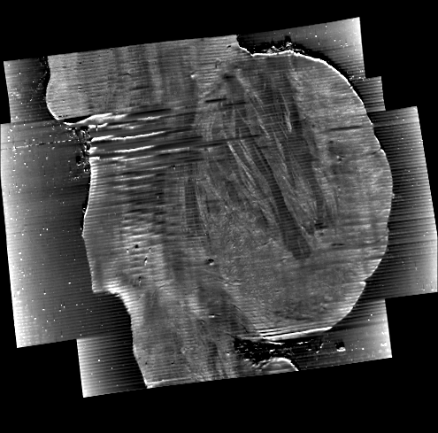
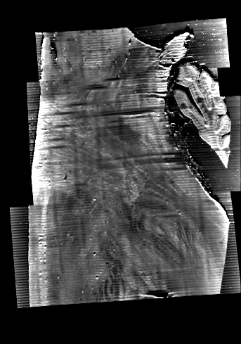
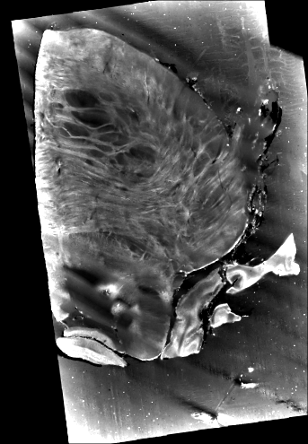
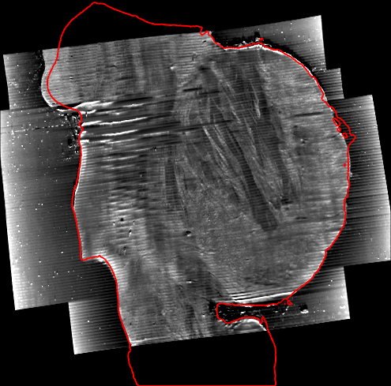
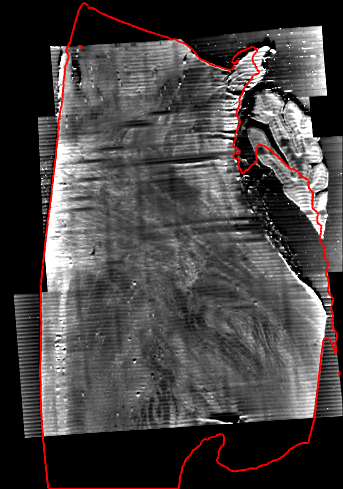
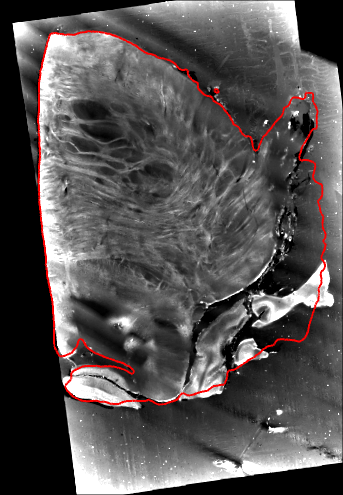

# octreg

octreg registers a serial-sectioning OCT volume of a tissue block to an ex-vivo MRI cropped around the block, with an affine
transform and a small smooth deformation on top. It uses no labels and needs no initial alignment, since it searches every
orientation of the block inside the MRI crop.

## How it works



**§1 Specimen mask.** Doped agarose scatters about as strongly as tissue, but its structure is directional. Section stripes and
tile seams vary along one array axis, while tissue texture varies along all three. The OCT specimen mask is the region of
isotropic texture, and the MRI foreground is a histogram threshold.

**§2 Two-class maps and outline.** Both scans become two-class maps, a soft split of the tissue into a brighter and a darker
class, scored together with the outline. OCT tissue must lie on MRI tissue, while the MRI may hold tissue beyond the block.
Swapping the OCT classes negates the two-class score exactly, so its sign gives the contrast polarity.

**§3 Orientation search.** An FFT search scores 8,000 rotations with all translations inside the MRI crop and keeps 24 poses.

**§4 Affine refinement.** Each pose is refined to a 12-parameter affine under a prior on scale and shear, since the score alone
rewards distorting the block.

**§5 Fine-structure refinement.** The best pose is refined on normalised gradient fields inside both scans. They follow fibre
bundles and vessels and need neither an intensity mapping nor the polarity.

**§6 Smooth deformation.** A small displacement field on a 5 mm control lattice is fitted to interior matches and surface-edge
offsets, as flexible as a strain limit of 0.15 allows. The field is applied only when it predicts held-out evidence at least
10 % better than no deformation. The affine stays the primary result.

The method uses two kinds of evidence, the shape of the specimen and the structure of the tissue, and each at two scales.

| evidence | global, for the affine (§2 to §5) | local, for the deformation (§6) |
|---|---|---|
| specimen shape | the outline: OCT specimen mask against MRI foreground | surface-edge offsets along the MRI boundary normals |
| tissue structure | two-class maps (§2 to §4) and normalised gradient fields (§5) | interior matches of the same normalised gradients at a finer scale |

None of them needs labels or an intensity mapping between the modalities. [docs/METHOD.md](docs/METHOD.md) gives every step
in full.

## Installation

```
git clone https://github.com/yyttim/oct-mri-registration
cd oct-mri-registration
pip install -e .
```

octreg requires Python 3.9 or newer and PyTorch. A CUDA GPU is recommended for full-size volumes. `pip install -e ".[test]"`
adds the test dependencies, and `pytest` runs the tests on synthetic data on the CPU.

## Usage

```
octreg register OCT MRI -o OUT [--oct-spacing-um Z,Y,X] [--oct-mask F] [--mri-mask F] [--params F] [--device cuda|cpu]
octreg qc --run OUT --oct OCT --mri MRI [--T F] [-o PREFIX] [--oct-spacing-um Z,Y,X] [--oct-mask F] [--mri-mask F]
octreg apply --run OUT --moving X --reference Y -o Z [--inverse] [--affine-only] [--oct-spacing-um Z,Y,X]
```

`register` runs §1 to §6 and writes the outputs below into `OUT`. The OCT can be NIfTI, TIFF, OME-TIFF or NPY, and the MRI is
NIfTI. `--oct-spacing-um` gives the OCT voxel spacing in µm when the file has none. `--oct-mask` and `--mri-mask` replace the
automatic masks with files whose positive voxels are the mask. `--params` reads parameter overrides from JSON (the fields of
`octreg.params.Params`, listed in [docs/METHOD.md](docs/METHOD.md#parameters)), and `--device cpu` runs without a GPU.

`qc` renders the QC images of the affine again, for the run's transform or for another one given with `--T`. `-o` sets the
output prefix (default `OUT/qc`, or `OUT/qc_<T stem>` for another transform), and the other options default to those of the
run.

`apply` resamples an OCT-frame volume onto the grid of an MRI-frame `--reference`, through the affine and, when the run wrote
one, the deformation field. `--affine-only` leaves the field out. With `--inverse` it resamples an MRI-frame volume onto an
OCT-frame reference through the affine alone, since the field is not inverted. `--oct-spacing-um` gives the spacing of an
OCT-frame TIFF or NPY and defaults to that of the run.

The same functions are available in Python: `from octreg.register import register, apply, qc`.

### Outputs

| file | content |
|---|---|
| `T_oct2mri.txt`, `T_mri2oct.txt` | 4×4 affine in mm between the world frames of the two input files |
| `oct2mri.lta`, `oct2mri_itk.txt` | the same affine for FreeSurfer and ITK |
| `oct2mri_warp.nii.gz` | the deformation of §6, only when it is applied: displacement u in mm along the MRI world axes on the MRI base grid (0.15 mm), as a NIfTI vector image (ITK and ANTs expect the first two components negated). The registered OCT at the MRI point x is OCT(T⁻¹(x + u(x))) |
| `oct_in_mri.nii.gz` | OCT on the MRI grid through the affine and the deformation |
| `oct_in_mri_affine.nii.gz` | OCT on the MRI grid through the affine alone (the same image when no deformation is applied) |
| `mri_in_oct.nii.gz` | MRI on the OCT base grid (0.15 mm), through the affine |
| `qc.png`, `qc_montage.png` | QC of the affine in four columns: OCT, MRI through the transform, a checkerboard of the two, and the OCT with the outlines of the MRI foreground (red) and the specimen mask (cyan). `qc.png` shows one plane per OCT array axis, `qc_montage.png` four |
| `qc_deform.png` | only with a deformation: MRI, OCT through the affine, OCT through the affine and the deformation, and the field magnitude, on three planes with the MRI outline |
| `result.json` | inputs, parameters and their hash, the transform, scores, contrast polarity, scales, the read-outs of §6, flags, time per step and peak memory |

A registration is judged by looking at it. In every plane of the QC images the MRI boundary should follow the edge of the OCT
specimen, and the OCT should lie on the same MRI anatomy.

## Inputs and assumptions

The OCT shows a tissue block embedded in scatterer-doped agarose. The specimen mask of §1 separates tissue from agarose by
texture, so it needs an embedding. A block that is not embedded should be given its mask with `--oct-mask`, and the OCT file
itself serves, since a mask file is read as its positive voxels. Exact zeros in the OCT are read as missing data. The OCT
contrast may be inverted relative to the MRI.

The MRI is an ex-vivo scan roughly cropped to a region containing the block. The crop is larger than the block and may hold
tissue that is not in it, for example beyond a face where the block was cut out of a larger specimen. The crop is the only
position prior.

Both voxel sizes must be correct, so the true scales are close to 1. A NIfTI orientation header (sform or qform) must be
correct, including its handedness. A TIFF or NPY stack (x, y, z = numpy axes 2, 1, 0), or a NIfTI file without sform and
qform, is taken in its array frame, which must then have the handedness of the specimen. §3 searches proper rotations only,
and the score of §2 cannot tell mirror images apart on a nearly symmetric block, so the registration does not correct a
frame of the wrong handedness.

§6 takes the surface edge of each scan as the steepest fall of intensity going outwards. This assumes that in both scans the
tissue at the surface is brighter than what surrounds it.

## Results on the I58 brainstem block

On the I58 pair (OCT 1457×2013×1595 at 20 µm, MRI crop 343×489×495 at 0.08 mm) the run takes 11 min 25 s, of which §6 is
20 s, with 5.2 GiB of RAM and 1.6 GiB of GPU memory allocated by torch (RTX 5090, Windows). §6 lowers the median
interior-match residual from 0.250 to 0.124 mm and the median surface-edge offset from 0.285 to 0.089 mm, with 80 % of the
offsets within 0.3 mm instead of 51 %. These are label-free read-outs of octreg, measured again on the warped OCT, and not
ground truth.

| sagittal | coronal | axial |
|---|---|---|
|  |  |  |
|  |  |  |
|  |  |  |

Three planes through the middle of the block in freeview. From top to bottom the rows show the MRI crop, the OCT registered onto
it (`oct_in_mri.nii.gz`, affine and §6), and the same OCT with the boundary of the MRI tissue in red. The boundary is the MRI
foreground rule of §1 applied to the crop at its own 0.08 mm. Each panel is the whole crop at one pixel per MRI voxel, 27.4 mm
from right to left, 39.6 mm from posterior to anterior and 39.1 mm from inferior to superior. The OCT specimen follows the
boundary and lies on the same anatomy. Where the boundary runs beyond the OCT, at both ends of the block, the MRI holds tissue
outside its cut faces. The grey around the specimen is the agarose, and the horizontal stripes in the sagittal and coronal
planes are the sections. Sagittal planes have anterior on the right, and coronal and axial planes show the subject's right on
the left.

Of eight standard registration tools run with their documented settings, only NiftyReg reg_aladin started from the image
centres reaches octreg's affine (0.3 mm over the specimen mask and 1 degree). No deformable tool started from that affine
fits the intact tissue visibly better than §6. ANTs SyN with a field-of-view mask scores closer on the read-outs, with
stronger local compression and about 150 times the run time ([bench/baselines/BASELINES.md](bench/baselines/BASELINES.md)).

The evaluation and the ablations are in [docs/METHOD.md](docs/METHOD.md) and [bench/BENCHMARK.md](bench/BENCHMARK.md).

## Reproducing the benchmark

The scripts in `bench/` run the I58 benchmark: the registration, the ablations, the label-free evaluation, the report
`bench/BENCHMARK.md` and the freeview figures (`bench/figures.py`). The I58 files are not distributed with the repository, and the stored results of the benchmark are in
`bench/results/I58/`. `python bench/evaluate.py --selftest` checks the evaluation on synthetic arrays without any of the
data. [bench/README.md](bench/README.md) describes the steps and how to point the scripts at the data, and
[bench/baselines/README.md](bench/baselines/README.md) the settings of the baseline comparison.
