# Baselines on the I58 brainstem pair

Standard registration tools run on the same two files as octreg. The affine stage compares eight tools. Each uses the
settings its documentation gives for volumes of different contrast, from each of its standard starting points: the header
alignment, the image centres, the tool's own global search, and the same with a field-of-view (FOV) mask of the OCT. No
setting is tuned on this pair. Every transform is checked against the image the tool itself resampled. Every result is
resampled from the 20 um OCT by the same code, so the overlays differ only by registration. Results are judged on the
overlays on 13 planes through the block and on four zooms of its superior end, as for octreg. Settings and scripts are in
[README.md](README.md), and the tables of all runs in `bench/results/I58/baselines/`.

## Affine

Each tool is shown with its best standard setting, judged on the overlays. The pose distance is the mean displacement over
the specimen mask between the tool's affine and octreg's, and the rotation is the angle between the two. Times are wall
clock on a machine shared with other jobs and only indicative.

| method | setting | result | scale per OCT axis | from octreg's affine | time |
|---|---|---|---|---|---|
| image centres aligned (start, no registration) | header orientation | | 1.00 / 1.00 / 1.00 | 2.4 mm, 11.1° | |
| octreg, §1 to §5 | defaults | correct | 0.98 / 0.97 / 0.99 | | 10 min |
| NiftyReg reg_aladin | image centres | correct | 0.97 / 0.96 / 0.98 | 0.3 mm, 1.0° | 5 min |
| greedy, NMI | image centres, FOV mask | stays at the start | 1.00 / 1.00 / 1.00 | 2.4 mm, 11.0° | 1 min |
| elastix, Mattes MI | centre of gravity, FOV mask | stays near the start | 1.03 / 0.99 / 1.01 | 2.4 mm, 10.6° | 0.5 min |
| mri_robust_register, NMI | centre of mass | stays near the start | 0.99 / 1.00 / 1.07 | 3.0 mm, 11.7° | 14 min |
| ANTs, Mattes MI | centre of mass, FOV mask | shifted 2 to 3 mm, enlarged | 1.28 / 1.01 / 1.10 | 2.9 mm, 6.6° | 1 min |
| mri_coreg, NMI | brute-force start | shrunk | 0.92 / 0.81 / 1.00 | 4.1 mm, 16.6° | 22 min |
| FLIRT, normmi | default search, FOV weight | shrunk, rotated | 0.86 / 0.81 / 0.78 | 4.9 mm, 6.0° | 74 min |
| SynthMorph | as documented | fails (out of domain) | | 28 mm, 38° | 1 min |

| MRI | image centres aligned (start) | octreg, §1 to §5 | NiftyReg reg_aladin |
|---|---|---|---|
| 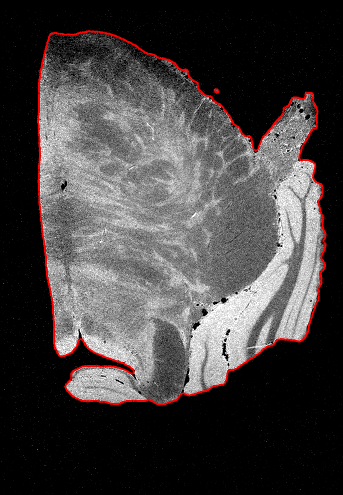 | 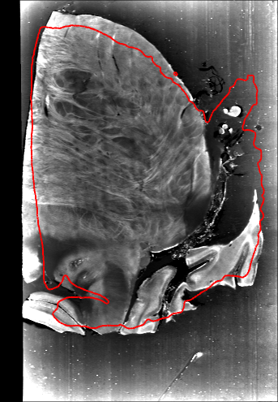 | 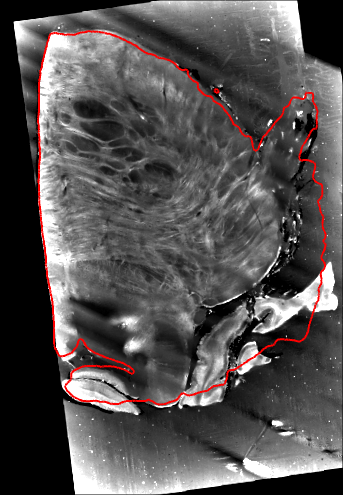 | 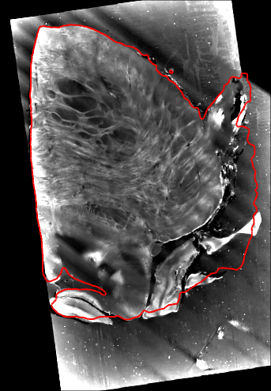 |
| **greedy** | **elastix** | **mri_robust_register** | **ANTs** |
| 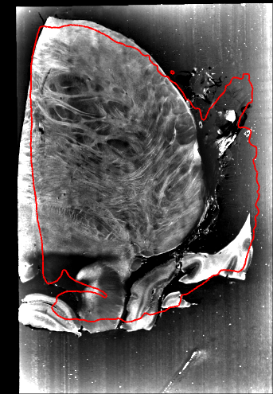 | 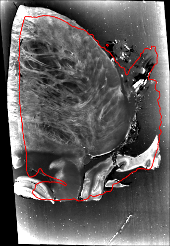 | 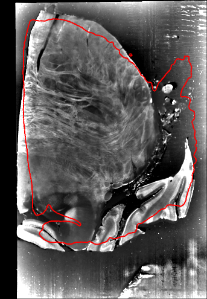 | 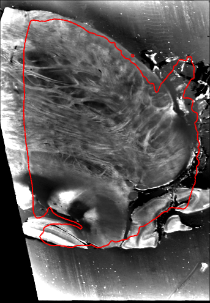 |
| **mri_coreg** | **FLIRT** | **SynthMorph** |  |
| 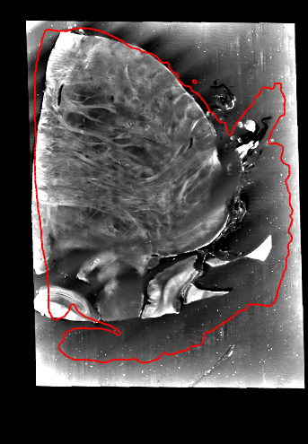 | 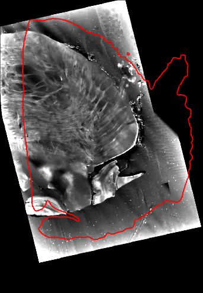 | 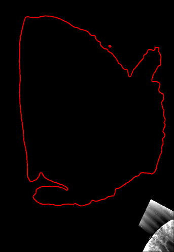 |  |

The axial plane of the README figure (z = 22.7 mm) for each tool at its setting in the table, in freeview, with the boundary
of the MRI tissue in red. Each panel is the whole MRI crop at one pixel per MRI voxel, 27.4 mm from right to left and 39.6 mm
from posterior to anterior. octreg and reg_aladin put the specimen on the boundary. greedy, elastix and mri_robust_register
stay near the start, ANTs enlarges the block, mri_coreg and FLIRT shrink it, and SynthMorph moves it almost entirely out of
this plane.

The header orientation of this pair is 11 degrees from the true pose, and the image centres put the block within a few
millimetres of it. From there greedy, elastix and mri_robust_register stay within about a degree of their start. ANTs,
mri_coreg and FLIRT change the size of the block by 10 to 30 % along some axis. The three global searches (antsAI, FLIRT
over ±180°, greedy -search) end on a flipped or non-overlapping pose. Only reg_aladin, started from the image centres, finds
the rotation. It agrees with octreg's affine to 0.3 mm over the specimen mask and 1 degree, its block is up to 2 % smaller
than octreg's, and its overlays cannot be told apart from octreg's. Started from the header alignment it ends 32 degrees
off. octreg needs neither start, since it searches every orientation inside the crop.

The outline scores, the rim outline agreement of `bench/evaluate.py` and the Dice of the masks, are in the full table but
do not rank the tools. A block that shrinks inside the MRI tissue scores well on them. The elastix run started from the
image centres shrinks the block by 26 % in volume and still has a better rim outline agreement than octreg's affine. The
scale column and the overlays decide.

## Deformable

Every tool starts from octreg's affine with both volumes on the MRI grid, so the fields are the only difference. The three
residual columns are the §6 read-outs measured on the warped OCT. They are octreg's own measurement, not ground truth. The
field statistics are over the MRI foreground, and the last column is what the overlays show.

| method | setting | interior matches (mm) | surface-edge offsets (mm) | surface-edge offsets, superior 4 mm (mm) | field median / max (mm) | Jacobian min | overlays | time |
|---|---|---|---|---|---|---|---|---|
| no deformation | octreg's affine | 0.250 | 0.285 | 0.82 | 0 | 1 | | |
| octreg, §6 | defaults | 0.124 | 0.089 | 0.22 | 0.28 / 1.05 | 0.94 | no artefact | 20 s |
| ANTs SyN, CC | FOV mask | 0.063 | 0.027 | 0.05 | 0.29 / 1.62 | 0.34 | as octreg's, one corner slightly bowed | 48 min |
| ANTs SyN, CC | script default | 0.049 | 0.024 | 0.03 | 0.68 / 3.41 | 0.03 | cut faces pulled into MRI tissue the OCT never imaged, stripes bent | 88 min |
| greedy, WNCC | FOV mask | 0.181 | 0.033 | 0.09 | 0.14 / 1.53 | 0.14 | superior cut face raised by up to 0.5 mm | 4 min |
| ConvexAdam, MIND-SSC | FOV mask | 0.220 | 0.052 | 0.09 | 0.48 / 1.92 | -0.54 | superior cut face lifted, corners bulged | 13 s (GPU) |
| elastix B-spline, Mattes MI | FOV mask | 0.367 | 0.254 | 0.65 | 0.27 / 0.59 | 1.00 | as octreg's, two small tears in the agarose | 43 s |
| NiftyReg reg_f3d, NMI | 5 mm grid | 1.232 | 0.615 | n/a | 4.82 / 12.70 | -0.70 | stripes bent into fans, block collapses in places | 8 min |

The residuals are medians. The superior 4 mm column is taken at the end of the block where the affine leaves the largest
misfit. A Jacobian below 0 means folded voxels (0.08 % for ConvexAdam, 4.7 % for reg_f3d).

| MRI | no deformation (octreg's affine) | octreg, §6 |
|---|---|---|
|  |  |  |
| **ANTs SyN, CC, FOV mask** | **ANTs SyN, CC, script default** | **greedy, WNCC** |
| 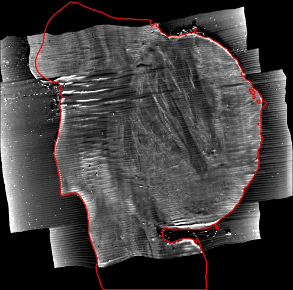 | 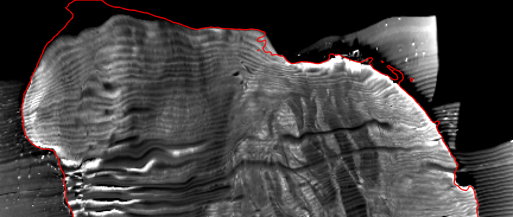 | 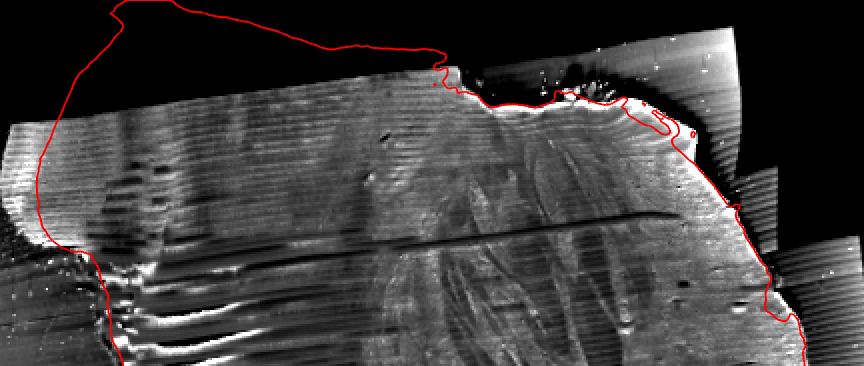 |
| **ConvexAdam** | **elastix B-spline** | **NiftyReg reg_f3d** |
| 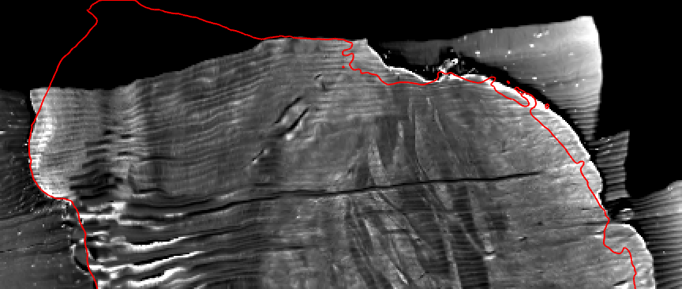 | 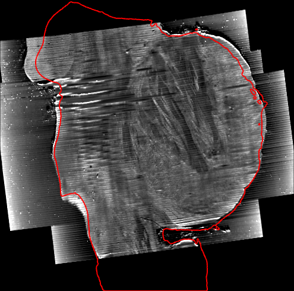 | 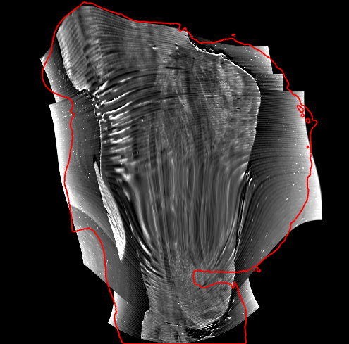 |

The superior end of the block on the sagittal plane through the largest displacement of §6 (x = 4.26 mm), in freeview, for
each tool at its setting in the table, with the boundary of the MRI tissue in red. Each panel is 34.6 mm from posterior to
anterior and 14.6 mm high, up to the top of the crop, at two pixels per MRI voxel, and the sections run horizontally. octreg's
affine, where every tool starts, leaves the anterior surface of the OCT (right) outside the boundary. §6, SyN with the FOV
mask and greedy bring it onto the boundary. Without the mask SyN pulls the OCT up into the MRI tissue beyond the cut face (top
left) and bends the sections. ConvexAdam lifts the cut face, elastix leaves the anterior surface where the affine put it, and
reg_f3d bends the sections into fans.

On the overlays no tool fits the intact tissue visibly better than §6. The fields that keep the block shape look the same as
octreg's by eye, also in zooms of the superior end. The read-outs resolve finer differences, and they are not biased towards
octreg. SyN with CC and the FOV mask fits both kinds of evidence closer than §6 (interior matches 0.063 against 0.124 mm,
surface-edge offsets 0.027 against 0.089 mm). Its field has the same median size and stronger local compression (Jacobian down
to 0.34 against 0.94), and the run takes about 150 times as long. Without the mask, which is the default of the official script,
SyN reaches still lower residuals by pulling the straight cut faces of the OCT out into MRI tissue the block does not contain.
Those residuals do not mean a better registration. greedy and ConvexAdam close the surface-edge offsets but improve the interior
matches only a little (0.18 and 0.22 against 0.25 mm without a field). elastix leaves the surface-edge offsets near the affine
and the interior matches worse, and reg_f3d distorts the block in every standard form. The full tables with every variant are
`bench/results/I58/baselines/affine.md` and `deform.md`.
