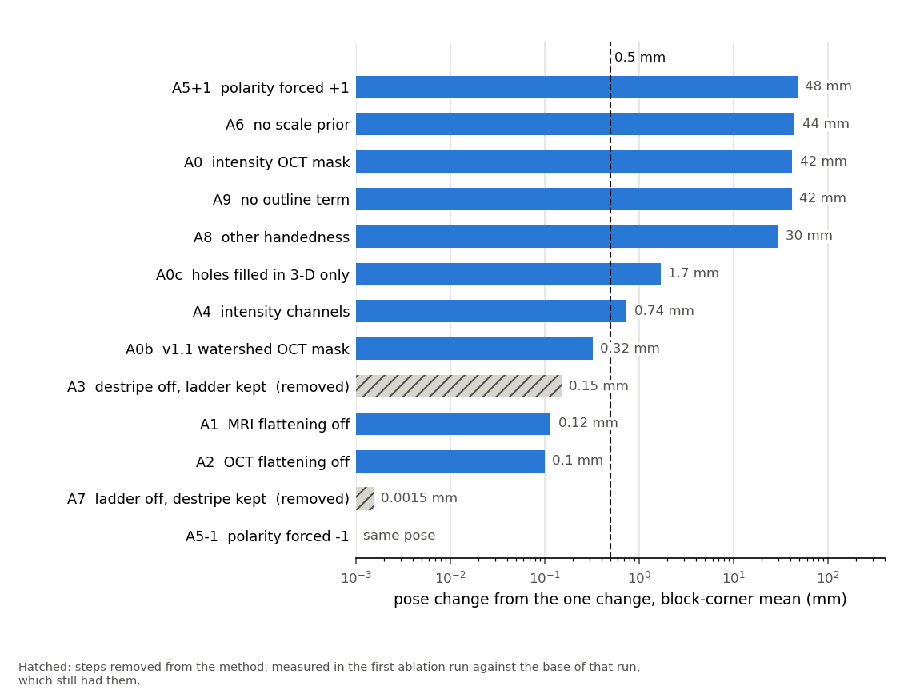

# Benchmark: Xiangrui's I58 brainstem pair

octreg 1.0 registered the two original files as given (OCT 1457x2013x1595 at 20 um, header LPI; MRI crop 343x489x495 at 0.08 mm, header RIA) with `octreg register OCT MRI -o OUT` and default parameters (Params hash 8900ced9d7d1677a). The pair has no labels. The result is judged by visual inspection of the overlays (docs/METHOD.md, "Evaluation"), and the label-free numbers below support that judgement. R5 is the pose of the earlier research pipeline (v1.1) converted into the header frames. It is a body-level pose, not ground truth. The numbers are read from the run's result.json and eval.json and from ablations.json (copies in docs/results/xiangrui_I58/). Wall clock and nvidia-smi memory come from the run logs on the server. Commands: `bash bench/run_xiangrui.sh` (see bench/README.md).

## Visual comparison

The final pose and R5 are 10.32 mm apart at the block corners (mean, max 16.47 mm) and rotated by 25.1 deg against each other, far beyond the run-to-run spread of about 1 mm of the earlier pipeline. They are two different poses, and the overlays decide between them. The QC panels of the final pose, of R5, of the pose in the other handedness and of a low-overlap competitor were inspected in all three planes. Only the final pose puts the MRI brainstem body on the OCT specimen, with no cerebellar folia inside the body, and matches the folded side piece. R5 and the other two fail at least one of these checks. Along parts of the specimen edge the OCT mask of the final pose still lies on MRI background, seen as bright MRI squares in the checkerboard below.

qc.png of the final run: planes through the centroid of the specimen mask, normal to each OCT array axis, with the OCT, the MRI through the transform and a 2 mm checkerboard in which the MRI is inverted inside the OCT mask (polarity -1). The current `octreg qc` adds a fourth column with the mask outlines.

The outline agreement does not separate the two poses. With the method's masks the rim medians favour the final pose (forward / reverse 1.88 / 1.24 mm against 2.80 / 1.37 mm for R5). With the v1.1 masks the final pose is better forward and worse in reverse (1.83 / 1.14 mm against 2.02 / 1.05 mm).

## Main result

| | |
|---|---|
| pose vs R5, mean (max) over the v1.1 specimen mask | 6.13 (12.79) mm |
| pose vs R5 at the block corners, mean (max) | 10.32 (16.47) mm |
| rotation vs R5 | 25.1 deg |
| raw-data frame check (Spearman) | 0.990 at the pose; axis flips <= 0.205; 2 mm shifts <= 0.417; pass |
| final score S, polarity | 0.1455, -1 |
| search top-1 / top-2 | 0.1655 / 0.1594 |
| refined poses below the overlap gate | 4 of 24 |
| scale per OCT array axis | 1.000 / 0.967 / 0.985 |
| overlap | 0.586 |
| flags | none |
| pose vs the previous run, mean / corners mean / corners max | 0.18 / 0.39 / 0.62 mm |
| boundary agreement in result.json (median, mm) | 2.02 |
| rim boundary agreement forward / reverse, method masks | 1.88 / 1.24 mm; R5 2.80 / 1.37; previous 1.88 / 1.23 |
| the same with the v1.1 masks | 1.83 / 1.14 mm; R5 2.02 / 1.05; previous 1.84 / 1.15 |
| OCT specimen mask | 16.88 cm3, Dice 0.910 against the v1.1 mask (18.05 cm3) |
| registration time in process, peak RAM, peak GPU memory allocated by torch | 8.6 min, 5.2 GB, 0.59 GB (wall clock 8.7 min, nvidia-smi peak 1.6 GB) |
| time per step (s) | mri 5, oct fine grid 196, oct mask 165, two class 2, search 46, refinement 73, outputs 31 |

The raw-data frame check passes, so the exported transform is in the frames of the two files. The pose is not within 1 mm of R5 at the block corners, and the visual comparison above is the reason the final pose is kept.

R5 in the header frames (T_R5 @ A_spr @ inv(A_hdr)) agrees with the stored header-frame export to 0.000000 mm.

## Ablations

Each variant is the method with one explicit change, run from the same preprocessed grids (one per OCT mask source). Pose change is against base (the method through the same driver), as the mean over the v1.1 specimen-mask points and the mean and max over the 8 corners of the OCT array. The boundary agreement uses the base masks for every variant, so it reflects the pose only.

| variant | change | pose change: mean / corners mean / corners max (mm) | vs R5 corners max (mm) | S | polarity | scale | rim fwd / rev (mm) | OCT mask cm3 (Dice) | time (s) |
|---|---|---|---|---|---|---|---|---|---|
| base | the method | 0.00 / 0.00 / 0.00 | 16.47 | 0.1455 | -1 | 1.000 / 0.967 / 0.985 | 1.88 / 1.24 | 16.88 (0.910) | 121 |
| A0 | OCT intensity foreground (histogram valley) instead of the texture specimen mask | 21.10 / 44.15 / 62.88 | 61.82 | 0.1274 | -1 | 0.983 / 0.978 / 0.985 | 2.78 / 1.72 | 29.52 (0.759) | 149 |
| A0b | v1.1 rim-watershed specimen mask given as the OCT mask | 14.93 / 30.31 / 46.46 | 46.84 | 0.1622 | -1 | 0.988 / 0.986 / 0.975 | 2.32 / 1.57 | 18.04 (1.000) | 125 |
| A1 | MRI flattening off | 0.21 / 0.30 / 0.52 | 16.25 | 0.1478 | -1 | 0.999 / 0.967 / 0.983 | 1.89 / 1.23 | 16.88 (0.910) | 120 |
| A2 | OCT flattening off | 14.75 / 30.86 / 41.73 | 48.22 | 0.1596 | -1 | 0.984 / 0.990 / 0.975 | 2.19 / 1.43 | 16.88 (0.910) | 119 |
| A4 | standardised intensity channels (z, -z) instead of two-class maps | 13.59 / 24.91 / 36.77 | 31.09 | 0.1761 | -1 | 0.998 / 0.979 / 0.983 | 2.78 / 1.79 | 16.88 (0.910) | 120 |
| A5+1 | polarity forced +1 | 11.07 / 12.04 / 19.59 | 19.08 | 0.1087 | 1 | 0.972 / 0.987 / 0.985 | 1.83 / 1.38 | 16.88 (0.910) | 120 |
| A5-1 | polarity forced -1 | 0.00 / 0.00 / 0.00 | 16.47 | 0.1455 | -1 | 1.000 / 0.967 / 0.985 | 1.88 / 1.24 | 16.88 (0.910) | 118 |
| A6 | no scale prior: lam 0 and clamp 1.0 (method: 2 and 0.15) | 11.85 / 22.42 / 40.45 | 43.97 | 0.2421 | -1 | 1.046 / 0.547 / 0.424 | 3.54 / 1.56 | 16.88 (0.910) | 113 |

Driver check: base through bench/ablate.py lies 0.00 mm (corners max 0.00 mm) from the CLI run.

Deletion rule of the spec: a step goes when removing it moves the pose by at most 0.5 mm (mean over the specimen-mask points) and changes no other metric beyond noise. Removing MRI flattening (A1, 0.21 mm) stays within 0.5 mm. Removing OCT flattening (A2, 14.75 mm) or the scale prior (A6, 11.85 mm) moves the pose further.

### Removed steps

Copied from the first ablation run, whose base still had the section-stripe flat field and the ladder, so pose changes in these rows are against that base. Removing either step moved the pose by less than the 0.5 mm deletion threshold, and both were deleted. The present base has neither.

| variant | change | pose change: mean / corners mean / corners max (mm) | vs R5 corners max (mm) | S | polarity | scale | rim fwd / rev (mm) | OCT mask cm3 (Dice) | time (s) |
|---|---|---|---|---|---|---|---|---|---|
| A3 | section-stripe flat field off | 0.07 / 0.15 / 0.24 | 16.23 | 0.1454 | -1 | 1.000 / 0.968 / 0.984 | 1.88 / 1.24 | 16.88 (0.910) | 147 |
| A7 | affine directly at the finest level from every search pose, no ladder | 0.00 / 0.00 / 0.00 | 16.14 | 0.1486 | -1 | 0.999 / 0.969 / 0.983 | 1.88 / 1.23 | 16.88 (0.910) | 121 |

The present base lies 0.18 mm (corners mean 0.39 mm, corners max 0.62 mm, rotation 0.92 deg) from the base of that run. Source: /data/bench_runs/xiangrui_I58/ablate/ablations.json.

## Runtime and memory of the ablation driver

| step | seconds | peak RAM of the process so far (GB) |
|---|---|---|
| OCT fine grid 728x1006x797 (streamed once) | 195 | 3.3 |
| prep intensity | 67 | 3.8 |
| prep texture | 156 | 5.0 |
| prep v11mask | 86 | 5.6 |
| prep mri | 5 | 0.7 |
| all variants and preprocessing | 1629 | 5.6 |

Peak GPU memory allocated by torch over the variants: 1.0 GB.

<!-- reading: written by hand below this line; bench/report.py keeps it when it rewrites the file -->

## Reading

Each of the three innovations changes the result on this pair. An intensity threshold on the OCT (A0) takes in the agarose (29.5 cm³ against 16.9 cm³), and the pose turns over by 176 degrees. Standardised intensities instead of two-class maps (A4) move the pose by 25 mm, and switching off the OCT flattening (A2) moves it by 31 mm. Forcing the polarity to +1 (A5+1) lowers S from 0.1455 to 0.1087 and moves the pose by 12 mm, while forcing the -1 that the sign rule chose (A5-1) changes nothing. Without the scale prior (A6), S rises to 0.2421 while the OCT is squeezed to 0.547 and 0.424 of its length along two axes, so the higher score comes with a non-physical pose. All distances are block-corner means.

Three variants end in the other handedness, 22 to 31 mm away. A6 gets there by shrinking the block, which also raises its overlap to 0.760. A0b uses the larger v1.1 mask, which lowers the overlap gate from 0.493 to 0.461, and its pose passes at 0.474. A2 passes the unchanged gate at 0.494. On this pair the other-handedness pose is never far from passing the gate, and overlap_rho = 0.6 was set on this pair, not derived.

MRI flattening stays although removing it moves the pose by only 0.30 mm (A1). The two-class map keeps one definition for both modalities, and without MRI flattening the gap between the two best search scores shrinks from 0.0061 to 0.0016.

The section-stripe flat field and the refinement ladder are removed. Switching off the flat field moved the first run's pose by 0.15 mm (A3), and the step took 365 s of that run's 906 s (docs/results/xiangrui_I58/first_run/result.json). One affine refinement from every search pose gave the ladder's pose to within 0.0015 mm (A7). Near the optimum the loss is flat: the A3 pose of the first run and the final pose have the same loss (L = 0.85763) and lie 0.24 mm apart. The final run needs 519 s and 5.2 GB in process, against 906 s and 8.3 GB for the first run.
