# octreg: method and evaluation

octreg registers an OCT volume of an embedded tissue block to an ex-vivo MRI cropped around it. §1 to §5 find an affine
transform, and §6 adds a small smooth deformation on top of it.

## Inputs and assumptions

The OCT is a scattering or intensity map of a block embedded in scatterer-doped agarose. It has section stripes along one array
axis, tile seams in the section plane and exact zeros where data are missing, and its contrast may be inverted relative to the
MRI. The MRI is an ex-vivo scan roughly cropped around the block. The crop is larger than the block. It is the only position
prior, and it may hold tissue that is not in the block, for example beyond a face where the block was cut out of a larger
specimen. Both voxel sizes are taken as correct, so the true scales are close to 1.

The OCT and the MRI show the same specimen, so they differ by a proper rotation and never by a mirror image. The file frames fix
the handedness, and §3 searches proper rotations only. A TIFF or NPY stack, or a NIfTI file without sform and qform, is taken in
its array frame, which must then have the handedness of the specimen. The score of §2 cannot tell mirror images apart on a
nearly symmetric block (on I58 the best mirrored pose has the lower L and ends 17.3 mm from octreg's affine).

Transforms map millimetres in the world frame of the OCT file to that of the MRI file. The world frame is the NIfTI header frame
or, for TIFF and NPY, diag(spacing) on the axes (x, y, z) = numpy axes (2, 1, 0). The OCT is streamed plane by plane into a
0.04 mm fine grid, where the specimen mask is computed. Both volumes have a 0.15 mm base grid, for the OCT a box average of the
fine grid (masks kept above 0.5). All later steps use the base grid, except the search of §3, which runs on its 4³ box average,
a 0.6 mm grid.

## §1 Specimen mask

Doped agarose scatters about as strongly as tissue, but its structure is directional. A section stripe varies only along the
sectioning axis and a tile seam only across the seam, while tissue varies along every direction. The fine OCT is smoothed
(normalised Gaussian, σ 0.08 mm), the running coefficient of variation c_a is computed along each array axis over 0.36 mm, and
the texture field C = min_a c_a is averaged over 0.16 mm blocks. log C is smoothed (σ 1.2 mm), split by Otsu's threshold, closed
(0.48 mm) and reduced to its largest component. Uniform tissue such as a white-matter bundle leaves holes, and a hole that
reaches a cut face is not enclosed in 3-D, so holes are filled in every array plane. On I58 the specimen mask measures
19.24 cm³, against 29.52 cm³ for an intensity threshold that takes in the agarose (both on the base grid, intersected with the
measured OCT). The rule needs the agarose embedding (see Scope).

The MRI foreground threshold is the first histogram valley, walking down from the brightest peak, that lies below 0.5 of its
smaller neighbouring peak (peaks found on the square root of the smoothed counts). Without one, nearly the whole field of view
is kept and the run is flagged `mri_foreground_no_valley`. The mask is closed with a ball of 2 voxels, its holes are filled in
3-D and components below `min_component` of the foreground volume are dropped. Either mask can be supplied as a file and is then
used as given.

## §2 Two-class maps and outline

OCT scattering and MRI intensity follow no fixed mapping, but in both the tissue falls into a brighter and a darker class. Each
volume I with foreground M is flattened: it is divided by its local foreground mean G(I M) / G(M) (Gaussian σ 10 mm) to give x.
x is blurred by one voxel as G(xM) / G(M), so that background and masked-out gaps do not bleed into tissue. With t the Otsu
threshold and s the standard deviation of the foreground values of x clipped at their 99.5th percentile, the two-class map is
p = sigmoid((x − t) / (0.25 s)).

The OCT enters as channels u = (p_O, 1 − p_O) with its specimen mask w as weight, the MRI as v = (p_M M, (1 − p_M) M). The class
structure alone is a weak signal, so the score also compares the outlines, w against M, over the measured OCT voxels q. The
outline is one-sided. OCT tissue has to lie on MRI tissue, but agarose over MRI tissue is no mismatch, since the crop can hold
tissue that is not in the block. The weight leaves that case out: q' = q (1 − (1 − w) E), with E = M inside the crop and 1
outside it.

    S_class = ½ [NCC_w(u_1, v_1) + NCC_w(u_2, v_2)],   S_outline = NCC_q'(w, M),   S = (2 |S_class| + S_outline) / 3.

S is the mean of the three correlations and has no weight to set. Weighted covariance is linear and ignores constants, so
NCC_w(1 − u, v) = −NCC_w(u, v). Swapping the OCT classes negates S_class exactly and leaves S_outline unchanged. One correlation
therefore scores both contrasts, and the sign of S_class is the polarity (−1: inverted). The identity needs the OCT channels to
sum to 1 wherever w > 0, which is why the mask is a weight and never multiplies them.

## §3 Orientation search

The crop bounds the position, so no global search is needed. For each of 8,000 rotations sampled uniformly on SO(3), the OCT
template is rotated about its box centre and S is computed over all translations with FFTs in the masked form of Padfield (IEEE
Trans. Image Process. 21:2706, 2012). Since q' = q − b E with b = q (1 − w), every sum of the outline NCC is a correlation of a
template with E, M, M² or M³. Outside the crop, OCT tissue counts as lying over background and agarose is left out. Each
rotation keeps its best translation, and non-maximum suppression (3 mm, 10°) leaves 24 poses.

## §4 Affine refinement

All 24 poses are refined on the base grid with their polarity fixed, since the search score does not settle their order:

    x_MRI = R(r) Sh(h) diag(exp(ℓ)) (x_OCT − c) + t,   L = 1 − S + λ (Σ ℓ_i² + Σ h_i²),   λ = 2,

with rotation vector r, shears h, log-scales ℓ and c the OCT box centre (Adam, 200 iterations, cosine schedule). The lowest L
wins. The penalty is the prior, and it is needed because S alone rewards distorting the block. Each ℓ_i and h_i is also clamped
to ±0.15. The clamp is a guard and not a parameter. With the penalty it is not reached on I58, and a run that reaches it is
flagged `clamp_saturated`.

## §5 Fine-structure refinement

The score of §2, dominated by the outline, finds the block, but an outline that carries a margin of agarose, or a cut face,
leaves the last millimetres open. The best pose of §4 is therefore refined on the internal structure of both volumes, such as
fibre bundles, vessels and nuclei, compared by normalised gradient fields (Haber and Modersitzki, 2006). Each volume I with mask
m is smoothed and differentiated inside the mask by normalised convolution, g = ∇(G_σ(I m) / G_σ(m)), so the mask edge adds no
gradient. The normalised gradient is n = g / √(|g|² + ε²), with ε the median |g| over the MRI points used and over the OCT
specimen mask. Both masks are eroded by five base-grid voxels (0.75 mm), so the outline counts only in §2 to §4. Over every
second interior MRI voxel along each axis, with the eroded OCT mask w,

    F(T) = Σ_x w(T⁻¹x) (n_O(x) · n_M(x))² / Σ_x w(T⁻¹x),   g_O(x) = A⁻ᵀ g_OCT(T⁻¹x),

with A the linear part of T. The squared cosine compares only the orientation of edges. An inverted contrast flips the sign of a
gradient and the square removes it, so F needs neither an intensity mapping nor the polarity. L = 1 − F + λ (Σ ℓ_i² + Σ h_i²) is
minimised with Adam as in §4, from the §4 pose and under the same prior (λ = 2), with a fifth of the learning rates of §4, in
one pass of 150 iterations at each of σ = 0.6, 0.4 and 0.3 mm. Each pass keeps its lowest-L iterate. At these scales section
stripes a few tenths of a millimetre apart are smoothed away. §5 refines and does not search, and it can lower S, whose outline
and tissue classes are coarse.

## §6 Smooth deformation

The specimen deforms slightly between the MRI scan and the OCT embedding, and serial sectioning adds small distortions. After
the affine, local misfits of a fraction of a millimetre remain. §6 fits a small smooth displacement field on top of the affine.
The affine is the primary result. Every transform file holds it alone, and the field is written next to them.

The field u is a pull-back on the MRI base grid, in mm along the MRI world axes. The registered OCT at the MRI point x is
OCT(T⁻¹(x + u(x))). The OCT and its specimen mask are resampled onto the MRI base grid through T (mask kept above 0.99), and two
kinds of label-free evidence are measured there, interior matches and surface-edge offsets. Both have one reach, 1.35 mm. The
masks of §1 do not place the surface to a fraction of a millimetre, since the specimen mask is smoothed at σ 1.2 mm and the MRI
foreground is a threshold. §6 therefore reads the surface from the intensity of each volume.

Interior matches. MRI blocks of 4.5 mm, every 1.5 mm, with at least 70 % of the block inside both masks eroded by 0.6 mm, are
searched in the OCT within ±1.35 mm per axis. The score is the zero-mean normalised cross-correlation of the trace-free part of
n nᵀ (six channels, `octreg.blockmatch`), with n the normalised gradient of §5 at σ 0.24 mm. The Frobenius product of two such
tensors is (n · n′)² up to a term in the two magnitudes, so the block score is the local counterpart of F and also needs neither
an intensity mapping nor the polarity. A match counts when its peak stands 4 standard deviations above the mean of its score
map, off the border of the range, and its length is at most 1.35 mm. Each match gives a displacement at its block centre.

Surface-edge offsets. Up to 50,000 outermost voxels of the MRI foreground are sampled as boundary points, with outward normals ν
from the gradient of the smoothed signed distance to the surface (σ 2.5 voxels). Along each normal the intensity of each volume
is read from −2.1 to +2.1 mm, the reach and 0.75 mm beyond it, in base-grid steps, and differentiated with a Gaussian of
σ 1 sample. The surface edge is the steepest fall of the intensity going outwards. This assumes that in both volumes the tissue
at the surface is brighter than what surrounds it. In the MRI the tissue falls into background. In the OCT the surface carries a
bright rim, so the intensity falls going outwards into the agarose even where the bulk scatters alike, whatever the polarity of
the interior classes. A prominent fall is a local maximum of the fall more than 5 MADs above its median along the profile and
within ±1.35 mm, located to sub-sample precision by a parabola, which can carry it up to half a step beyond the reach. The
offset δ is the OCT edge minus the MRI edge along ν, and it constrains ν · u. The same rule finds both edges, so its bias and
the place of the sampled voxels relative to the true surface cancel in the difference. A boundary point is used only when at
least 95 % of its OCT profile is measured and each profile has exactly one prominent fall. Faces crossed by section stripes show
several falls and mostly drop out, so the sectioning axis need not be known.

The edge is used and not the bright rim, because the rim is a layer below the surface. Its ridge lies inside the surface by half
the thickness of the layer, which differs from face to face, so taking the ridge for the surface reads an offset where there is
none.

Model. Displacements c on a control lattice of 5 mm spacing over the bounding box of the MRI grid, trilinear in between, are
fitted by regularised least squares. Each interior match gives three rows and each boundary point one row ν · u = δ, weighted by
√(3N / M) for N matches and M points so that both kinds carry the same total weight. A membrane penalty with weight λ acts on
the first differences of c along the lattice axes, and a small ridge penalty keeps lattice nodes without evidence determined.
The system is solved four times with Huber re-weighting at 0.3 mm on both kinds of residual.

Model choice. Only λ is chosen, and the strain limit sets it. The strain, the largest first difference of c divided by the
spacing, must stay below 0.15 for the field to remain plausible for fixed tissue. The strain falls as λ grows, so λ is the
smallest weight between 0.3 and 30 that keeps the limit, found by bisection in log λ to a factor of 1.05. This gives the most
flexible field the limit allows. The field is then accepted only when it predicts evidence it was not fitted to. Both kinds of
evidence are split into four spatial folds (cells of 7 mm, with no buffer, so the test measures interpolation). At the chosen λ
the field is fitted without one fold and tested on it, for each of the four folds. The held-out median error of the interior
matches plus that of the surface-edge offsets, over all folds, must fall below 0.9 times the same score without deformation. The
held-out error alone does not bound the field, since on I58 it still falls a little past the strain limit (the strain limit 0.20
row of `bench/results/I58/deform_ablation.md`). The limit therefore sets λ, and the held-out error only gates the field. A field
is also refused with fewer than 100 interior matches or 300 boundary points, or when no weight up to 30 keeps the limit.
Whenever a field is refused, the run is flagged `deformation_not_supported` and no field is written.

The evidence is measured and the field fitted once. Both kinds of evidence are then measured again on the warped OCT, the
interior matches over every confident match before the length cut and the surface-edge offsets over every boundary point with
one edge. These residuals are the read-outs of the stage.

The field is written as oct2mri_warp.nii.gz, the read-outs go to result.json under `deform`, and [README](../README.md#outputs)
lists the outputs. The field is not inverted, so the MRI to OCT direction is affine only.

## Evaluation

A registration is judged by looking at it, because label-free numbers can prefer a wrong pose. qc_montage.png shows four planes
per OCT axis, each as the OCT, the MRI through the transform on the grey scale of the OCT, a checkerboard of the two over
everything the specimen mask or the MRI foreground reaches, and the OCT with both outlines. In every plane the MRI outline must
follow the edge of the OCT specimen, the specimen must lie on the same anatomy in the MRI, and internal structures must continue
across the checkerboard. Folded pieces, and cut faces that the MRI also shows, must correspond and lie on the same side, and the
contrast must be consistently inverted or not. `octreg qc --T` renders other candidate transforms for comparison.

### I58 brainstem pair

The OCT has 1457×2013×1595 voxels at 20 µm and the MRI crop 343×489×495 voxels at 0.08 mm. The run takes 11 min 25 s on the
original files with 5.2 GiB of RAM and 1.6 GiB of GPU memory allocated by torch (RTX 5090, Windows). Of this, §3 takes 33 s,
§4 345 s and §6 20 s. §1 to §4 give S 0.2781 (S_class −0.1020, S_outline 0.6302) and polarity −1. §5 raises F from 0.089 to
0.103 and moves the block by 3.75 mm at its corners (1.98 mm over the specimen mask, 8.8°), with scales 0.977 / 0.974 / 0.985.
At the §5 pose S is lower, 0.244 (S_class −0.055). A frame check confirms that the exported overlay follows the header and the
transform. Raw 20 µm OCT values mapped through the header and the transform correlate with the affine overlay at Spearman 0.991,
against at most 0.266 with any OCT axis flipped.

§6 finds 502 interior matches and 18,041 boundary points and takes λ 0.82 at strain 0.148. The held-out median errors fall from
0.247 to 0.155 mm for the interior matches and from 0.285 to 0.114 mm for the surface-edge offsets. Re-measured on the warped
OCT, the median residual of the interior matches falls from 0.250 to 0.124 mm and that of the surface-edge offsets from 0.285 to
0.089 mm, and the offsets within 0.3 mm rise from 51 % to 80 %. Over the MRI foreground the field has a median of 0.28 mm and a
maximum of 1.05 mm. It is largest at the superior end of the block, where the surface-edge offsets are largest. In 4 mm sections
along the sectioning axis, the median surface-edge offset falls from 0.82 to 0.22 mm in the first section at that end and from
0.65 to 0.19 mm in the next. In each of the other sections it falls from between 0.10 and 0.40 mm to between 0.04 and 0.13 mm.
These values per section are stored in `bench/results/I58/deform_ablation.json`. §6 looks for interior matches and surface edges
only within the 1.35 mm reach, so it does not bring back tissue that lies farther than that from its MRI position.

The [README](../README.md#results-on-the-i58-brainstem-block) shows the result on three planes in freeview. The first row of the
deformable comparison in [BASELINES.md](../bench/baselines/BASELINES.md#deformable) shows the OCT through the affine alone and
through the affine and §6 on the same sagittal plane.

### Ablations

Each variant is the method with one element removed or replaced, run on the same two files with everything else unchanged. The
affine variants are shown through their own affine. The §6 variants are fitted at octreg's affine, as the deformable baselines
are. Every panel is the sagittal plane of the README figure in freeview, the whole MRI crop at one pixel per MRI voxel, with the
boundary of the MRI tissue in red. Anterior is on the right and superior at the top. At octreg's pose the red line runs beyond
the OCT at the top left and at the bottom, where the MRI holds tissue beyond the cut faces at the two ends of the block.
Distances are the mean displacement from octreg's affine over a regular sample of the specimen mask, with the rotation angle
between the two. They say how far a variant ends from the method, and the panels show which pose fits.

| variant | step | result | scale per OCT axis | from octreg's affine |
|---|---|---|---|---|
| octreg, §1 to §5 |  | correct | 0.98 / 0.97 / 0.99 |  |
| intensity-threshold mask instead of the texture mask | §1 | turned over | 0.99 / 0.99 / 1.00 | 23.9 mm, 158° |
| no outline term | §2 | turned over | 1.00 / 1.00 / 1.00 | 23.4 mm, 176° |
| no two-class term (the outline alone) | §2 | turned | 0.99 / 0.99 / 0.99 | 5.8 mm, 23.0° |
| no orientation search, from the image centres | §3 | as octreg's | 0.98 / 0.97 / 0.99 | 0.00 mm, 0.0° |
| no scale and shear penalty | §4 | turned over and shrunk | 0.86 / 0.87 / 0.88 | 17.3 mm, 141° |
| no fine-structure refinement | §5 | close, not on the boundary | 0.99 / 0.96 / 0.97 | 2.0 mm, 8.8° |

| MRI | octreg, §1 to §5 | image centres aligned (start, no registration) |
|---|---|---|
| 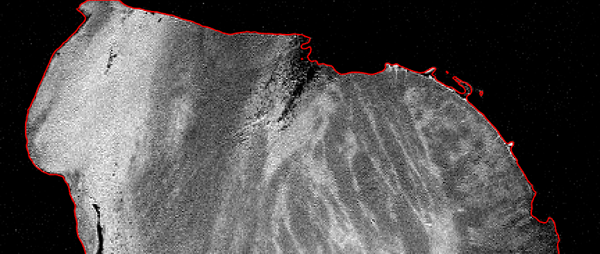 | 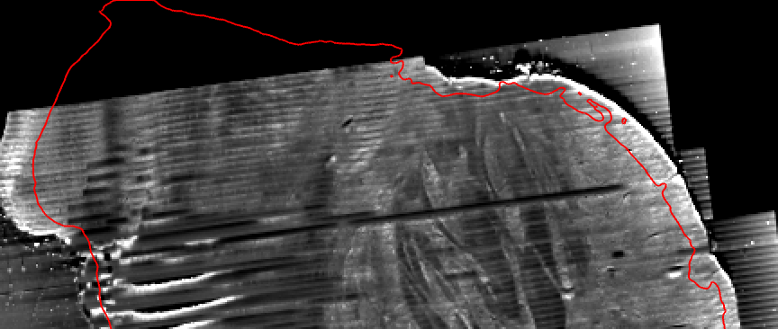 | 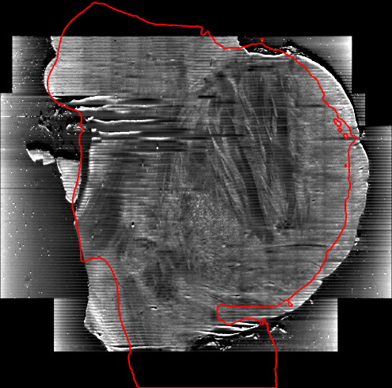 |
| **intensity-threshold mask** | **no outline term** | **the outline alone** |
| 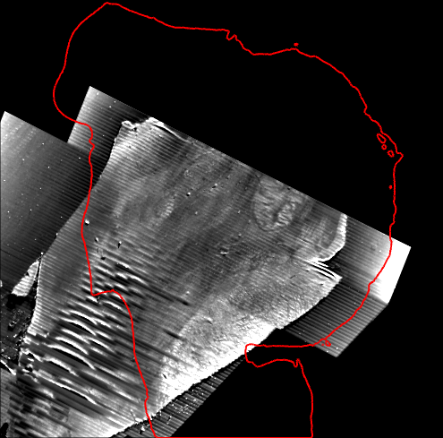 | 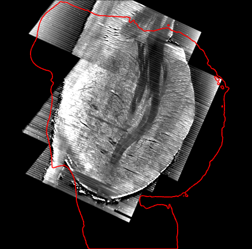 | 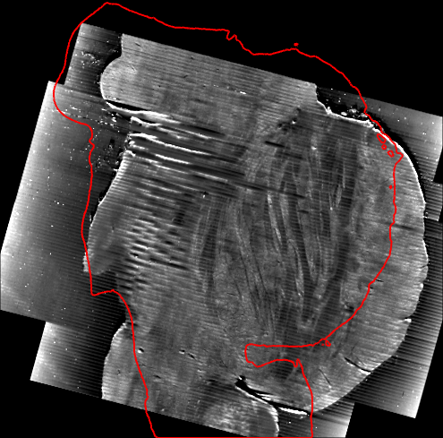 |
| **no orientation search** | **no scale and shear penalty** | **no fine-structure refinement** |
| 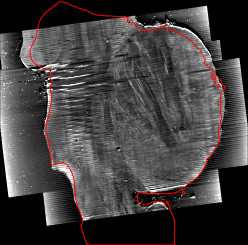 | 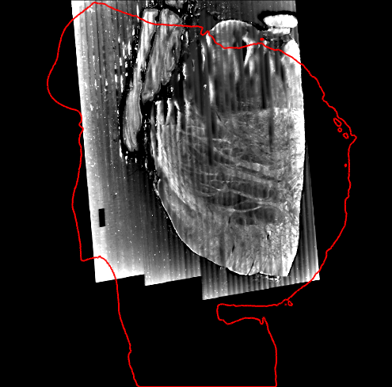 | 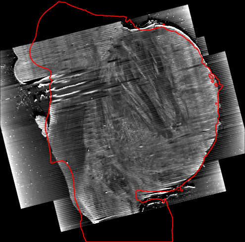 |

The texture mask, the outline term and the scale and shear penalty decide the pose. Without any one of them the block ends
turned over, and the section stripes, nearly level in octreg's panel, slant or stand upright. Without the penalty, §4 shrinks
the block until all three log-scales sit at the clamp of −0.15, and that pose scores higher than the method's §4 pose (S 0.334
against 0.278), since S alone rewards distorting the block. With the outline alone the block ends turned by 23°. In its panel
the anterior surface leaves the boundary and the tissue covers the gap near the inferior end. Its §4 pose has a higher outline
score than the method's (S_outline 0.668 against 0.630) but a two-class score near zero (|S_class| 0.007 against 0.102), so the
outline alone prefers a wrong pose and the two-class term rejects it. Without §5 the block lies close to octreg's pose but not
on it. Along the boundary it fits better in some places and worse in others, for example at the gap near its inferior end, and
its fine structure agrees less with the MRI (F 0.089 against 0.103). Without the orientation search, §4 and §5 started from the
image centres reach octreg's affine, because the header orientation of this pair is only 11° from it.

The start test asks what the search adds. The OCT is turned by 90° and 180° about each of its array axes, through the centre of
its image box, and the method and the variant without the search run from each turned start. The table gives the distance of
each start and of each result from octreg's affine.

| start | the start | octreg | no orientation search |
|---|---|---|---|
| image centres, header orientation | 2.4 mm, 11.1° | 0.00 mm, 0.0° | 0.00 mm, 0.0° |
| turned 90° about OCT array axis 0 | 15.3 mm, 83° | 0.00 mm, 0.0° | 14.3 mm, 78° |
| turned 180° about OCT array axis 0 | 22.9 mm, 173° | 0.00 mm, 0.0° | 22.2 mm, 155° |
| turned 90° about OCT array axis 1 | 14.4 mm, 86° | 0.00 mm, 0.0° | 17.4 mm, 115° |
| turned 180° about OCT array axis 1 | 20.4 mm, 176° | 0.00 mm, 0.0° | 20.1 mm, 163° |
| turned 90° about OCT array axis 2 (the sectioning axis) | 15.2 mm, 98° | 0.00 mm, 0.0° | 17.5 mm, 114° |
| turned 180° about OCT array axis 2 (the sectioning axis) | 20.2 mm, 173° | 0.00 mm, 0.0° | 21.3 mm, 170° |

| turned 90° about the sectioning axis (start) | no orientation search | octreg |
|---|---|---|
| 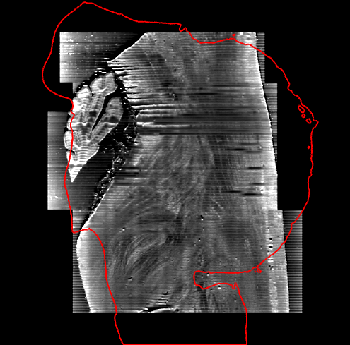 | 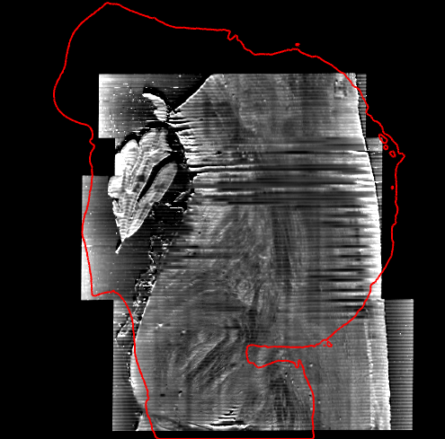 |  |

From every turned start the method returns to octreg's affine, by less than 0.002 mm, since its search covers all orientations.
Without the search, §4 and §5 end 14 to 22 mm and 78° to 170° away, about as far as the starts themselves.

The §6 variants fit the field at octreg's affine to one kind of local evidence at a time, with λ chosen by the rule of the
method, the smallest weight between 0.3 and 30 that keeps the strain below 0.15. Both kinds of evidence are then measured again
on the warped OCT. The table gives their medians, over the whole block and over the 4 mm at its superior end, and the field over
the MRI foreground. These are octreg's own label-free read-outs.

| variant | λ | interior matches (mm) | surface-edge offsets (mm) | surface-edge offsets, superior 4 mm (mm) | field median / max (mm) |
|---|---|---|---|---|---|
| no deformation (octreg's affine) |  | 0.250 | 0.285 | 0.82 | 0 |
| octreg, §6 | 0.82 | 0.124 | 0.089 | 0.22 | 0.28 / 1.05 |
| interior matches only | 0.30 | 0.101 | 0.237 | 0.79 | 0.21 / 1.02 |
| surface-edge offsets only | 8.22 | 0.458 | 0.091 | 0.20 | 0.35 / 1.10 |

| MRI | no deformation (octreg's affine) | octreg, §6 |
|---|---|---|
|  |  | 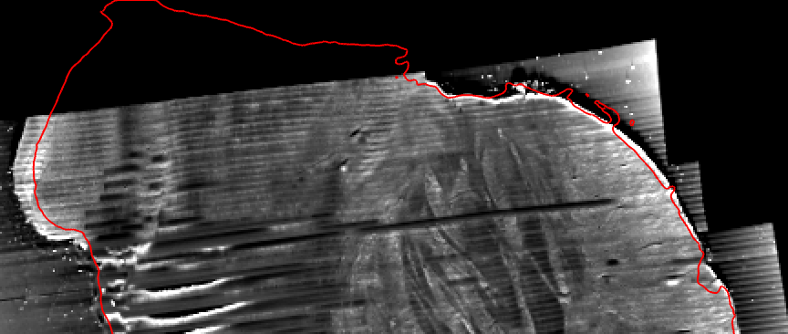 |
| **interior matches only** | **surface-edge offsets only** | |
| 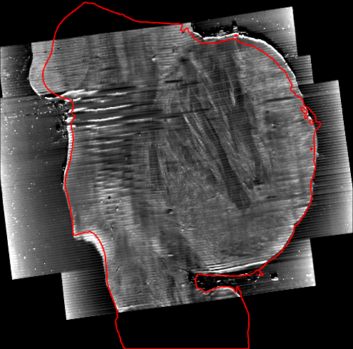 | 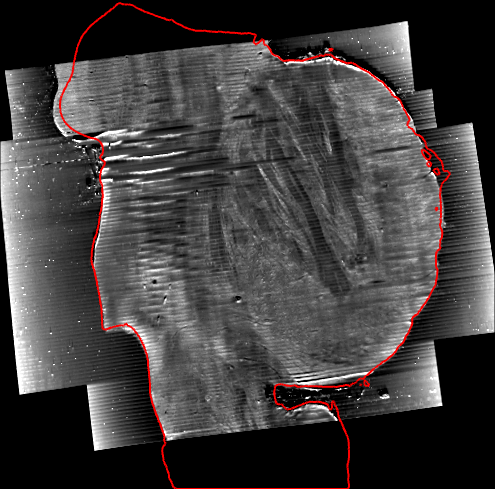 | |

Each kind of local evidence alone leaves the misfit of the other kind. With the interior matches only, the surface near the
superior end stays where the affine put it, as without deformation (0.79 mm in the superior 4 mm, against 0.22 mm with §6). With
the surface-edge offsets only, the surface fits as with §6, but the interior matches end farther off than without deformation
(0.458 against 0.250 mm). This misfit lies inside the block, not at its surface where the panels draw the boundary.

[bench/BENCHMARK.md](../bench/BENCHMARK.md) lists every variant of §1 to §5 that `bench/ablate.py` runs, with the start test,
and [bench/results/I58/deform_ablation.md](../bench/results/I58/deform_ablation.md) every variant of §6. Of the §1 to §5
variants not shown here, the flattening of either volume turned off, holes filled in 3-D only, standardised intensities in place
of the two-class maps, the polarity forced to the method's own, the two-sided outline, a simulated cut face and the clamp of §4
and §5 removed each change the final affine by less than 0.12 mm. The wrong polarity and the mirrored OCT end 17 to 20 mm away,
and with the penalty and the clamp both removed the block ends 17.1 mm away at scales of 0.40 to 0.58. The §6 variants there
also cover the rim ridge in place of the edge, boundary points only near interior matches, no Huber re-weighting, coarser
lattices, other strain limits and a longer reach.

## Parameters

The constants of the method are fields of `octreg.params.Params` (override with `--params`). The I58 pair uses the defaults,
whose hash is `da914d8ccc555207`. The first nine rows state what the method assumes about the data, and the rest set how a step
is computed. The scales of §1, the sigmoid width, the rotation set and the erosions are set by hand on the I58 pair.

Each stage also holds guards and fixed rules at the top of its module, outside Params. In §4 and §5 this is the clamp of ±0.15
on log-scales and shears. In §6 these are the range 0.3 to 30 of λ, the 10 % held-out gain, the least evidence of 100 interior
matches and 300 boundary points, the 0.75 mm a boundary profile runs beyond the reach, the limit of 50,000 boundary points, the
σ of 2.5 voxels on the signed distance, the four folds of 7 mm cells, where the cell with index k goes to fold
(k · (1, 3, 5)) mod 4, the ridge weight 1e-2 on the lattice displacements, the four Huber rounds and the 70 % of a block that
must lie inside both masks.

| parameter | default | role |
|---|---|---|
| `texture_bandpass_mm`, `texture_window_mm` | 0.08, 0.36 mm | §1: smoothing before, and window of, the directional coefficient of variation |
| `texture_smooth_mm`, `texture_close_mm` | 1.2, 0.48 mm | §1: smoothing of log C, closing radius |
| `flatten_sigma_mm` | 10 mm | §2: scale of the local foreground mean that flattens the intensities |
| `lam` | 2.0 | §4 and §5: weight λ of the scale and shear prior |
| `ngf_sigmas_mm`, `ngf_erode_mm` | 0.6, 0.4, 0.3 mm, and 0.8 mm | §5: gradient scales of the passes, erosion of both masks |
| `df_sigma_mm`, `df_block_mm` | 0.24, 4.5 mm | §6: gradient scale of the interior matches, edge of the matched blocks |
| `df_reach_mm` | 1.35 mm | §6: reach of the evidence, search range of the interior matches and largest distance of a surface edge from the MRI surface |
| `df_erode_mm` | 0.6 mm | §6: erosion of both masks that keeps the blocks inside |
| `df_grid_mm`, `df_max_strain` | 5 mm, 0.15 | §6: spacing of the control lattice, strain limit |
| `search_mm`, `base_mm`, `fine_mm` | 0.6, 0.15, 0.04 mm | search grid, base grid, OCT grid of the specimen mask |
| `valley_ratio`, `min_component` | 0.5, 0.01 | MRI histogram valley / smaller peak, and the smallest MRI foreground component kept, as a fraction of the foreground |
| `texture_grid_mm`, `sigmoid_std` | 0.16 mm, 0.25 | texture blocks, and the sigmoid width in foreground standard deviations |
| `n_rot`, `seed`, `topk` | 8000, 0, 24 | rotations, rotation set seed, poses refined |
| `nms_mm`, `nms_deg` | 3 mm, 10° | poses closer in both count as one |
| `iters`, `lr_rot`, `lr_t`, `lr_ls`, `lr_sh` | 200, and 0.02 rad, 0.3 mm, 0.01, 0.01 | §4: Adam iterations and learning rates (§5: `ngf_iters` 150 per pass, a fifth of the rates) |
| `df_step_mm`, `df_z_min` | 1.5 mm, 4 | §6: grid step of the block centres, standard deviations above the mean of its score map a match needs |
| `df_edge_mad`, `df_huber_mm` | 5, 0.3 mm | §6: prominence of a fall in MADs above the median of the profile derivative, Huber threshold of both residuals |

## Scope

octreg is evaluated on one brainstem block, I58, which is unpublished. The constants set by hand (see Parameters) were chosen on
the same block. The specimen mask of §1 needs the agarose embedding. Without it there are not two classes, and the threshold
splits the tissue itself, more so where section stripes make tissue quiet along one axis. A block without embedding needs its
specimen mask given with `--oct-mask`. The OCT file itself can serve, since a mask file is read as its positive voxels.
